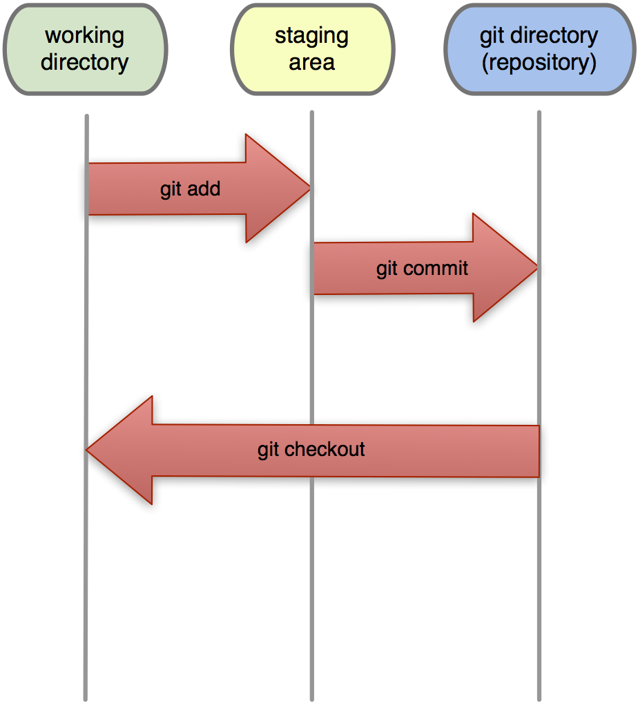

本章介紹 Git 的本地操作指令，不需要網路即可操作。

# Git 基本操作

Git 是分散式的，表示你不需要伺服器，在本地端就有完整的*Repository*。

## 建立、新增、修改、遞交

從頭建立 Repository：

	mkdir sandbox
	cd sandbox
	git init

第一次 commit 遞交：

	touch README
	git add README
	git status
	git commit -m “First Commit”

修改看看：

	編輯 README 做些變更
	git status
	git diff
	git add .
	(一次加入所有變更跟新增檔案，但不包括刪除的檔案!)
	git status
	git diff --cached
	git commit -m “Update README”

## Staging Area

一個 Git 目錄裡，可以分成三種區域：

* 目前工作目錄 Working tree
* 暫存準備遞交區 Staging Area
* 儲存庫 Repository

而 Working tree 裡的檔案有四種狀態：

* 沒有被追蹤的檔案 Untracked files
* 有修改、還沒準備要被遞交 Changes not staged for commit
* 有修改、準備要被遞交的檔案(在Staging Area) Changes to be committed
* 已經被遞交的檔案 Committed

Staging Area 算是 Git 獨有的功能，有什麼好處呢?

* Working tree 可能很亂，包含了想要 commit 的內容和不相關的實驗修改等
* Staging area 的設計可以讓你只 commit 想要的檔案，甚至是想要的部份修改而已
* Staging Area 又叫作 Index

只 commit 部分檔案：

	touch a.rb
	touch b.rb
	git add a.rb
	git commit “Update a”
	git add b.rb
	git commit “Update b”

staging 之後又再修改內容：

	修改 a.rb
	git add a.rb
	再次修改 a.rb
	git commit -m “commit a”
	這時 commit 的內容是第一次修改當時的內容而已

只 commit 同一檔案部分內容：

	git add --patch
		y 加到 staging
		n 不要加到 staging
		s 可以拆小一點 hunk

或者用 GUI 例如 gitx 來選取

在 commit 之前如何復原修改? 使用 git reset 和 git checkout 指令，你打 git status 就有提示了，不需要記起來。

## 刪除和搬移檔案

	git rm a.rb
	git mv b.rb c.rb
	git add .
	git commit “Remove a, Rename b to c”
	
沒有 copy ? 因為 Git 是追蹤內容(相同內容SHA1相同)，你只要 cp 即可，不用擔心浪費空間。

## revert (還原 commit 記錄)

	新增一筆 commit 來做還原
	例如本來的 commit 是新增一行，那麼 revert commit 就會移除那一行
	git revert e37c75787
	git revert HEAD^

## Tag 下標籤

	git tag foo
	git tag foo <SHA1>
	git tag bar -m “some message”
	git tag
	git tag -d foo

## 歷史紀錄

	git log
	git log --oneline
	git log --oneline --decorate --graph
	git log 很多參數可以用，但是建議還是用 GUI 吧...

## 查看程式碼逐行的歷史紀錄

	git blame <filename>
	git blame -L 100,10 <filename>

`-L`參數可以從第一百行開始顯示10行

## 比較差異 Diff

	git diff <SHA1> 拿 Working Tree 比較
	git diff <SHA1> <SHA1>
	git diff --stat <SHA1>
	git diff --cached 或 git diff --staged
	拿 Staging Area 來比較

## 砍掉 untracked 檔案

	git clean -n 列出打算要清除的檔案
	git clean -f 真的清除
	git clean -x 連 gitignore 裡列的檔案也清掉

## 忽略不需要追蹤的檔案

	編輯 .gitignore (屬於專案的設定，會 commit 出去)
	編輯 ~/.gitignore (你個人的 Global 設定)
	空目錄不會 commit 出去，必要時需要放 .gitkeep 檔案

[.gitignore 大集合](https://github.com/github/gitignore)

通常什麼檔案不需要 commit 出去?

* tmp/*
* log/*
* 你個人環境的設定檔(例如你偏愛的編輯器設定檔)
* 可以自動產生的檔案
* build/* 等 compile 之後的檔案
* .DS_Store
* Thumbs.rb

## Commit 基本原則

* 適當的粒度/相關性/獨立性
	* 以一個小功能、小改進或一個 bug fixed 為單位。
	* 對應的 unit test 程式在同一個 commit
	* 無相關的修改不在同一個 commit
	* 語法錯誤的半成品程式不能 commit
* git diff --check 可以檢查多餘的空白
* commit 訊息很重要
	* 第一行寫摘要
	* 有需要寫實作細節的話，放第二行之後

## 開分支

何時開 Branch ?

* Topic feature 開發新功能
* Bug fixes
* 重構 (refactor)
* 任何實驗

開分支：

	git branch new_feature
	git branch 或 git branch <SHA1>
	git checkout new_feature
	(以上兩步可以合一 git checkout -b new_feature)
	touch new_feature.rb
	git add new_feature.rb
	git commit -m “New feature”

合併 branch 回來

	git checkout master
	git merge new_feature

> Git 預設的 branch 叫做*master*

Branch 更名和刪除

	git branch -m old_name new_name
	git branch -M old_name new_name (強制覆蓋)
	git branch new_feature -d
	git branch new_feature -D (強制刪除)

## 四種合併方式

### 1. Straight merge 預設的合併模式

保留被合併的 branch commits 記錄，並加上一個 merge commit，看線圖會有兩條 Parents 線。
如果是 fast-forward，就不會有 merge commit。除非加上 --no-ff 參數。

### 2. Squashed commit

	git merge new_feature --squash

壓縮成只有一個 merge-commit，不會有被合併的 log。SVN 的 merge 即是如此。

### 3. cherry-pick

	git cherry-pick 714cba

只合併指定的 commit
-x 參數會在 log 裡加注本來是哪個SHA1 (適合用在 backpointing 情境)

## 使用 branch 注意事項

切換 working tree 的 branch 時，如果有檔案在 staging area 或是 modified，會無法切換。
可以先 commit，反正只要不 push 出去，再  reset 回來即可

或是用 stash 指令暫存起來

	git stash
	git stash apply
	git stash clear

## 什麼是 Three-way merge

* two-way merge 只用兩個檔案進行合併 (svn預設即 two-way merge)
* three-way merge 除了要合併的兩個檔案，還加上兩個檔案的共同祖先。如此可以大大減少人為處理 conflict 的情況。

## Git merge strategy

1. recursive，當共同的祖先不只一個 commits 時，遞迴式的進行 three-way merge (此為預設)

		git merge foobar -s recursive -X ours
		git merge foobar -s recursive -X theirs
		
2. resolve，直接挑一個共同的祖先進行 three-way merge
3. octopus，當合併超過兩個以上的 branchs 時
4. ours，只用自己的 branch 的 commits
5. subtree 合併成一個子目錄

## Git 可以一次合併多個 Branchs

	git merge A B C
